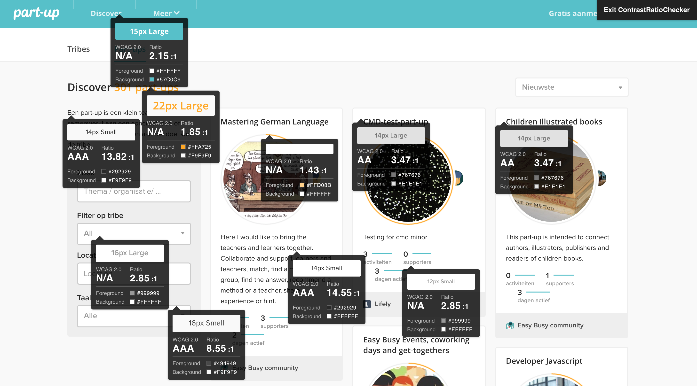
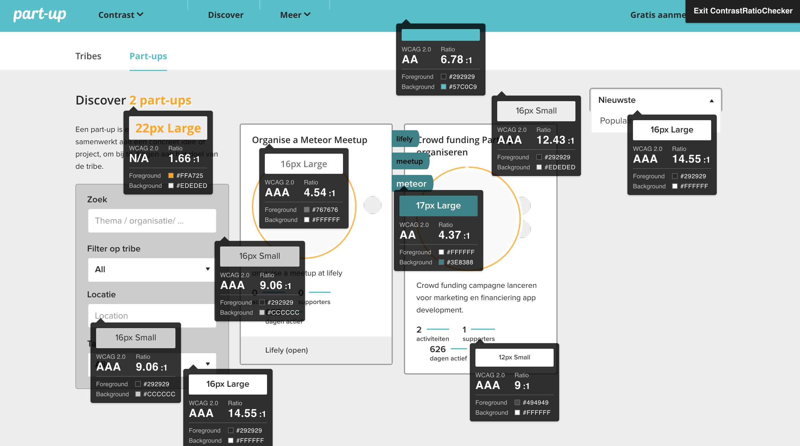

Part-up contrast contribution
=================

My contribution is adding a toggle between the normal stylesheet of the website and a stylsheet optimized for users that need more contrast to see the difference between elements.

These users are people who visite the website outside when the sun is shinning and users that are colorblind.

## Index
- [Changes](#changes)
- [Result](#result)

--------

## [Changes](#changes)
The things I changed was adding two scripts, adding a new stylesheet and adding a button/navigation item.

# HTML
The HTML I changed was for the buttons for the dropdown menu/toggle. I made these changes in the logo.html because I couldn't access the menu. I made 3 buttons, two for the contrast and one for the menu.

```html
 <button class="pu-button pu-button-header pu-button-header-text" data-toggle-menu="menu" id="contrast-dd" onclick=""> Contrast
       <i class="picon-caret-slim-down"></i>
       </button>
       <div class="pu-dropdown pu-dropdown-simple pu-dropdown-more" id="dd-content" data-clickoutside-close>
           <ul class="pu-list">
               <li>
                    <button id="no-contrast" onclick="">
                        Normaal
                    </button>
               </li>
               <li>
                    <button id="contrast">
                        Hoog contrast
                    </button>
               </li>
           </ul>
       </div>
       <section class="hide" id="hide" onclick="">
           <p>xx</p>
       </section>
```

# CSS
I created a new stylesheet for the .changeContrast. By doing this I could change the styles, but not overwrite the original ones. I altred the CSS in colorsContrast.sass which is located in app > client > stylesheets > variables. In the stylesheet I tried to use as much color variables from the stylesheet colors.sass to try to honor the styleguide.

# JavaScript
To be able to switch between the contrast I needed to add a toggle. With this script I said that if the button 'normaal' was clicked it has to remove the classname changeContrast from the body. If the button 'hoog contrast' is clicked, than it should add the class changeContrast to the body and it will switch to the other stylesheet. (For the demos I placed the codes in the main.html)

```javascript
        document.getElementById('no-contrast').addEventListener('click', function(){
           document.querySelector('body').classList.remove('changeContrast');
            console.log("IK WERK OOK");
        })

        document.getElementById('contrast').addEventListener('click', function(){
           document.querySelector('body').classList.add('changeContrast');
            console.log("IK WERK");
        })
```

Another script I used was to make a dropdown menu-item for the contrast buttons. I used the same principle as I dit with the stylesheet toggle.

```javascript
        document.getElementById('contrast-dd').addEventListener('click', function(){
           document.getElementById('dd-content').classList.add('pu-dropdown-active');
            console.log("JA IK ZIE JE");
        })

        document.getElementById('hide').addEventListener('click', function(){
            document.getElementById('dd-content').classList.remove('pu-dropdown-active');
            console.log("ZIE JE ME");
        })
```
------

## [Result](#result)
For the complete results of my research check this <a href="ContrastRatioResearch.pdf">PDF</a>.

I used a tool called 'Contrast Ratio Checker'. It gives information about font sizes, colors, the ratio and if it is approved according to WCAG 2.0. This is what it was before:



After improving the website it became this:



As you can see I improved almost every ratio, except for the color orange. This color isn't a good match for the background and the only way I can solve that problem is changing the color.


## Resources
- https://webdesignledger.com/the-principle-of-contrast-in-web-design/
- http://www.webdesignerdepot.com/2010/09/fully-understanding-contrast-in-design/
- https://24ways.org/2013/why-bother-with-accessibility/
- https://24ways.org/2012/colour-accessibility/
- https://www.smashingmagazine.com/2014/10/color-contrast-tips-and-tools-for-accessibility/
- http://tomkenny.design/articles/the-principles-of-good-web-design-part-3-colour/
- http://veen.com/jeff/archives/000503.html
